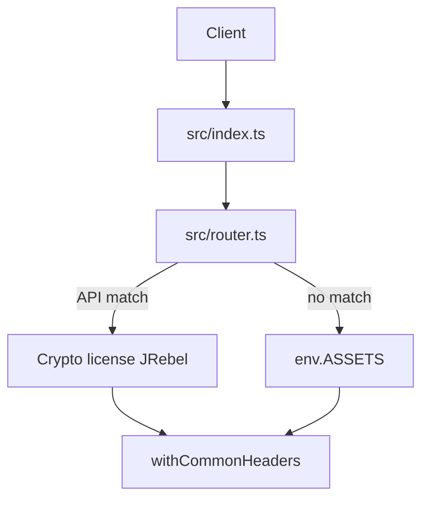

# Architecture

## Runtime model

A single **Cloudflare Worker** handles every HTTP request first:

1. **`fetch`** (`src/index.ts`) invokes **`route`** (`src/router.ts`).
2. If `route` returns a **`Response`**, it is wrapped with **common security headers** and returned.
3. If `route` returns **`null`**, the request is forwarded to **`env.ASSETS.fetch(request)`** (files under `public/`), then the same header wrapper is applied.

This matches Cloudflare’s **Worker + Static Assets** pattern: one deployment unit, one origin for the browser and for JetBrains IDE license clients.

## Request flow

## Data and crypto

- **Product/plugin lists** are imported at bundle time from **`src/data/*.json`** (no network fan-out at runtime for catalogs).
- **RSA operations** use **Web Crypto** with keys from **`src/generated/pem.ts`** (build-time embedding).
- **License XML** is built as strings and signed like the Java `LicenseServerUtils` flow (comment + SHA1 over XML body).

## Caching and CORS

- **`/api/products`** and **`/api/plugins`**: `Cache-Control: public, max-age=600`.
- **Public read CORS** (`*`) applies only to `/api/health`, `/api/products`, `/api/plugins` (including `OPTIONS` preflight).

## Related

- Chinese: [../zh-CN/ARCHITECTURE.md](../zh-CN/ARCHITECTURE.md)
