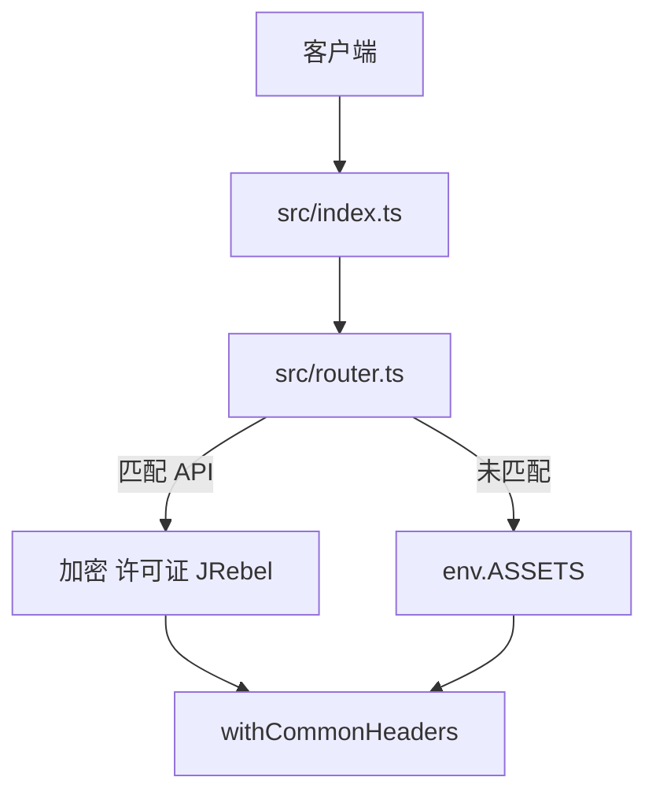

# 架构说明

## 运行时模型

**单个 Cloudflare Worker** 优先处理所有 HTTP 请求：

1. **`fetch`**（`src/index.ts`）调用 **`route`**（`src/router.ts`）。
2. 若 `route` 返回 **`Response`**，则套上**通用安全响应头**后返回。
3. 若返回 **`null`**，则把请求交给 **`env.ASSETS.fetch(request)`**（`public/` 静态文件），同样再套安全头。

即 Cloudflare 的 **Worker + 静态资源** 模式：一次部署、浏览器与 JetBrains 许可证客户端**同源**访问。

## 请求路径（示意）

## 数据与密码学

- **产品/插件列表** 在打包时从 **`src/data/*.json`** 引入（目录接口不在运行时拉远程列表）。
- **RSA** 使用 **Web Crypto**，密钥来自构建期生成的 **`src/generated/pem.ts`**。
- **许可证 XML** 按 Java 版 `LicenseServerUtils` 思路构造并对正文做 SHA1 签名（注释内带签名与证书摘要）。

## 缓存与 CORS

- **`/api/products`、`/api/plugins`**：`Cache-Control: public, max-age=600`。
- **公共只读 CORS**（`*`）仅用于 `/api/health`、`/api/products`、`/api/plugins`（含 `OPTIONS` 预检）。

## 相关

- 英文版：[../en-US/ARCHITECTURE.md](../en-US/ARCHITECTURE.md)
